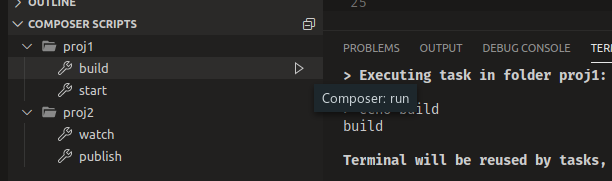
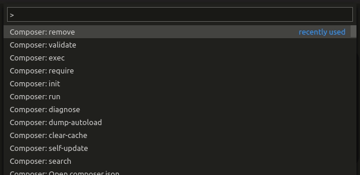

# Composer Companion

This is a companion extension for [**Composer**](https://getcomposer.org/), a dependency manager for PHP. Check out it's features below.

## Features

### Composer Scripts

Shows scripts in a dedicated view inside Explorer container, where you can easily run them or open their respective _composer.json_ file.

### Tasks

Scripts can also be found as tasks in _**Terminal > Run Task / Run Build Task**_.

### Easy access to Composer commands

Press _**Ctrl+Shift+P**_ and start typing _**composer**_ to see all the available commands. The necessary inputs or arguments can be conveniently picked from a menu.

### Schema Validation

Validates and offer hints about the _**composer.json**_ file structure.

## Requirements

- **Composer**, version 1.9.0 or higher recommended (https://getcomposer.org/download/)
- **PHP**, version 5.3.2 or higher

## Extension Settings

This extension contributes the following settings:

* `composerCompanion.enabled` ( **true** | false ): If Composer Companion is enabled or not. It can be used in _user_, _workspace_ and _folder_ settings.
* `composerCompanion.executablePath` ( string ): Path to the composer executable. It can be used in _user_ and _workspace_ settings; if not specified the extension will try to pick it automatically, otherwise you'll see a warning.
* `composerCompanion.showScriptsInExplorer` ( **true** | false ): If Composer Companion should add a scripts view to the Explorer container. It's only available in the _user_ settings.

## Support

If you liked this extension consider leaving a rating and/or review.

#

### Third-Party Notices
- [**Codicons**](https://github.com/microsoft/vscode-codicons) icons used under a [Creative Commons Attribution 4.0 International Public License](https://creativecommons.org/licenses/by/4.0/legalcode), see the LICENSE file at https://github.com/microsoft/vscode-codicons/blob/master/LICENSE
- **Composer logo** used under a MIT License, see the LICENSE file at https://github.com/composer/composer/blob/master/LICENSE
